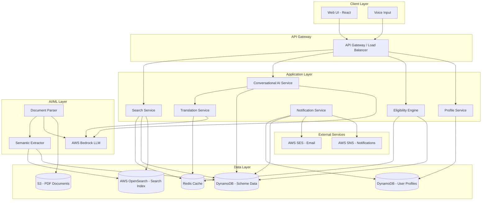

# Design Document: JanaSetu AI

## Overview

JanaSetu AI is a government welfare scheme discovery platform that leverages AI to provide personalized scheme recommendations to Indian citizens. The system addresses the critical challenge of fragmented government welfare information by ingesting government PDFs, extracting structured data, and matching users to relevant schemes based on their demographic and socioeconomic profiles.

The platform consists of several key components:
- User profile management system
- AI-based eligibility matching engine
- Government document parser with semantic extraction
- Conversational AI interface with voice support
- Regional language translation service
- Deadline monitoring and notification system
- Unified dashboard for scheme discovery

The design prioritizes scalability, fault tolerance, and accessibility for users with varying levels of digital literacy and internet connectivity.

## Architecture

### High-Level Architecture



### Component Interaction Flow

1. **User Registration Flow**: User → Web UI → Profile Service → DynamoDB
2. **Scheme Discovery Flow**: User → Web UI → Eligibility Engine → Scheme DB → Cache → Web UI
3. **Conversational Query Flow**: User → Voice/Text → Conversational AI → LLM → Translation Service → User
4. **Document Ingestion Flow**: PDF → S3 → Document Parser → Semantic Extractor → Scheme DB
5. **Notification Flow**: Notification Service → Scheme DB + User Profiles → SNS/SES → User

### Technology Stack

- **Frontend**: React with responsive design, Progressive Web App (PWA) capabilities
- **Backend**: Node.js with Express for API services
- **AI/ML**: AWS Bedrock (Claude/Titan models), Python for document parsing
- **Database**: DynamoDB for user profiles and scheme data
- **Search**: AWS OpenSearch Service for full-text search and filtering
- **Storage**: S3 for PDF documents and static assets
- **Cache**: Redis for frequently accessed scheme data and LLM response caching
- **Notifications**: AWS SNS (SMS), AWS SES (Email)
- **Infrastructure**: AWS Lambda for serverless functions, API Gateway, CloudFront CDN

## Components and Interfaces

### 1. Profile Service

**Responsibility**: Manage user profile creation, updates, and retrieval.

**Interface**:
```typescript
interface ProfileService {
  createProfile(userData: UserProfile): Promise<ProfileId>
  updateProfile(profileId: ProfileId, updates: Partial<UserProfile>): Promise<void>
  getProfile(profileId: ProfileId): Promise<UserProfile>
  deleteProfile(profileId: ProfileId): Promise<void>
  validateProfile(userData: UserProfile): ValidationResult
}

interface UserProfile {
  profileId: string
  age: number
  income: number
  educationLevel: EducationLevel
  casteCategory: CasteCategory
  location: Location
  occupation: string
  language: Language
  createdAt: Date
  updatedAt: Date
}

interface Location {
  state: string
  district: string
  pincode: string
  isRural: boolean
}

enum EducationLevel {
  BelowTenth = "BELOW_10TH",
  Tenth = "10TH",
  Twelfth = "12TH",
  Graduate = "GRADUATE",
  PostGraduate = "POST_GRADUATE"
}

enum CasteCategory {
  General = "GENERAL",
  OBC = "OBC",
  SC = "SC",
  ST = "ST",
  EWS = "EWS"
}

enum Language {
  English = "EN",
  Hindi = "HI",
  Tamil = "TA",
  Telugu = "TE",
  Kannada = "KN",
  Marathi = "MR",
  Gujarati = "GU",
  Bengali = "BN"
}
```

**Implementation Notes**:
- Validate age (1-120), income (positive), and required fields
- Encrypt sensitive data (income, location) before storage
- Implement audit logging for all profile operations
- Support partial updates without overwriting entire profile

### 2. Eligibility Engine

**Responsibility**: Match user profiles against scheme eligibility criteria and rank results.

**Interface**:
```typescript
interface EligibilityEngine {
  matchSchemes(profileId: ProfileId): Promise<RankedScheme[]>
  calculateRelevanceScore(profile: UserProfile, scheme: Scheme): number
  checkEligibility(profile: UserProfile, scheme: Scheme): EligibilityResult
}

interface Scheme {
  schemeId: string
  name: string
  description: string
  category: SchemeCategory
  eligibilityCriteria: EligibilityCriteria
  benefits: string
  deadline: Date | null
  requiredDocuments: string[]
  applicationProcess: string
  sourceUrl: string
  lastUpdated: Date
}

interface EligibilityCriteria {
  minAge?: number
  maxAge?: number
  minIncome?: number
  maxIncome?: number
  educationLevels?: EducationLevel[]
  casteCategories?: CasteCategory[]
  states?: string[]
  occupations?: string[]
  gender?: Gender
  additionalCriteria?: string
}

interface RankedScheme {
  scheme: Scheme
  relevanceScore: number
  eligibilityStatus: EligibilityStatus
  matchedCriteria: string[]
}

enum EligibilityStatus {
  Eligible = "ELIGIBLE",
  NotEligible = "NOT_ELIGIBLE",
  PartiallyEligible = "PARTIALLY_ELIGIBLE"
}

enum SchemeCategory {
  Education = "EDUCATION",
  Agriculture = "AGRICULTURE",
  Business = "BUSINESS",
  Housing = "HOUSING",
  Health = "HEALTH",
  Employment = "EMPLOYMENT",
  SocialWelfare = "SOCIAL_WELFARE"
}
```

**Matching Algorithm**:
1. **Pre-filtering**: Use DynamoDB GSI to filter by user's state and category
2. **Eligibility Evaluation**: Check age, income, education, category, location, occupation
3. **Relevance Scoring**: Base score (100) + deadline proximity + benefit amount + profile completeness
4. **Sorting and Pagination**: Sort by relevance score, return top 50 schemes
5. **Caching**: Cache results per profile hash with 1-hour TTL

**Performance Optimization**:
- Use GSI for initial filtering (avoid full table scans)
- Batch processing for eligibility evaluation
- Profile-based caching with Redis
- Parallel evaluation with Promise.all()

### 3. Document Parser

**Responsibility**: Extract structured data from government PDF documents.

**Interface**:
```typescript
interface DocumentParser {
  parseDocument(s3Key: string): Promise<ParsedScheme>
  extractText(pdfBuffer: Buffer): Promise<string>
  identifySchemeMetadata(text: string): Promise<SchemeMetadata>
  extractEligibilityCriteria(text: string): Promise<EligibilityCriteria>
  extractDocumentRequirements(text: string): Promise<string[]>
}

interface ParsedScheme {
  name: string
  description: string
  category: SchemeCategory
  eligibilityCriteria: EligibilityCriteria
  benefits: string
  deadline: Date | null
  requiredDocuments: string[]
  applicationProcess: string
  confidence: number
}

interface SchemeMetadata {
  name: string
  issuingDepartment: string
  publicationDate: Date
  category: SchemeCategory
}
```

**Parsing Pipeline**:
1. **Text Extraction**: Use pdf-parse library to extract raw text
2. **Preprocessing**: Clean text, remove headers/footers, normalize whitespace
3. **Semantic Extraction**: Use AWS Bedrock LLM with structured prompts
4. **Validation**: Verify extracted data completeness
5. **Storage**: Save parsed scheme to DynamoDB with confidence score

**Data Freshness Policy**:
- Revalidate all schemes every 7 days
- Schemes with deadlines revalidated 30 days before deadline
- High-traffic schemes revalidated every 3 days
- Schemes not revalidated within 60 days marked as inactive

**Error Handling**:
- Log errors and skip failed documents
- Flag schemes with confidence < 70% for manual review
- Implement retry logic for transient LLM failures

### 4. Conversational AI Service

**Responsibility**: Handle natural language queries and provide contextual responses.

**Interface**:
```typescript
interface ConversationalAI {
  processQuery(query: string, profileId: ProfileId, conversationId: string): Promise<Response>
  processVoiceQuery(audioBuffer: Buffer, profileId: ProfileId): Promise<Response>
  generateDocumentChecklist(schemeId: string, profileId: ProfileId): Promise<string[]>
  explainEligibility(schemeId: string, profileId: ProfileId): Promise<string>
}

interface Response {
  text: string
  translatedText?: string
  suggestions: string[]
  relatedSchemes?: Scheme[]
  requiresClarification: boolean
}

interface ConversationContext {
  conversationId: string
  profileId: ProfileId
  messages: Message[]
  lastUpdated: Date
}

interface Message {
  role: "user" | "assistant"
  content: string
  timestamp: Date
}
```

**Conversation Flow**:
1. **Input Processing**: Text direct, Voice via AWS Transcribe
2. **Context Retrieval**: Load last 10 messages
3. **Profile Enrichment**: Fetch user profile
4. **Scheme Data Retrieval**: Query relevant schemes
5. **LLM Query**: Send to AWS Bedrock with system prompt
6. **Response Generation**: Parse and format response
7. **Translation**: Translate if needed
8. **Context Update**: Save message to history

**Retrieval-Augmented Generation (RAG) Strategy**:
1. **Query Intent Classification**: Determine intent type
2. **Scheme Retrieval**: Retrieve relevant schemes (top 5)
3. **Document Excerpt Extraction**: Extract relevant sections
4. **Context Assembly**: Combine profile, schemes, excerpts
5. **LLM Augmentation**: Provide context to LLM

**AI Guardrails and Safety Controls**:
- Input validation and sanitization
- LLM instruction constraints (use only verified data)
- Response validation layer (consistency checks)
- Safety logging and hallucination detection
- Fallback to rule-based responses if validation fails

**Fallback Mechanism**:
- Library of 50+ common Q&A pairs
- Rule-based responses for common queries
- Direct eligibility engine trigger for eligibility questions

### 5. Translation Service

**Responsibility**: Translate content between English and regional languages.

**Interface**:
```typescript
interface TranslationService {
  translate(text: string, targetLanguage: Language): Promise<string>
  translateBatch(texts: string[], targetLanguage: Language): Promise<string[]>
  detectLanguage(text: string): Promise<Language>
}
```

**Implementation**:
- Use AWS Bedrock LLM for translation
- Cache translations in Redis with language-specific keys
- Fallback to English if translation fails
- Pre-translate common UI strings

### 6. Notification Service

**Responsibility**: Send deadline alerts and reminders to users.

**Interface**:
```typescript
interface NotificationService {
  scheduleDeadlineAlerts(): Promise<void>
  sendNotification(profileId: ProfileId, message: string, channel: NotificationChannel): Promise<void>
  getUserPreferences(profileId: ProfileId): Promise<NotificationPreferences>
  updatePreferences(profileId: ProfileId, prefs: NotificationPreferences): Promise<void>
}

interface NotificationPreferences {
  enableSMS: boolean
  enableEmail: boolean
  deadlineAlertDays: number[]  // e.g., [30, 7, 1]
}

enum NotificationChannel {
  SMS = "SMS",
  Email = "EMAIL",
  InApp = "IN_APP"
}
```

**Notification Logic**:
1. Daily job at 9 AM IST
2. Find schemes with deadlines in [30, 7, 1] days
3. Find eligible users for each scheme
4. Filter by user preferences
5. Dispatch via SNS (SMS) or SES (Email)
6. Track delivery status

### 7. Search Service

**Responsibility**: Enable keyword search and filtering of schemes.

**Interface**:
```typescript
interface SearchService {
  searchSchemes(query: string, filters: SearchFilters): Promise<Scheme[]>
  filterSchemes(filters: SearchFilters): Promise<Scheme[]>
  getSuggestions(partialQuery: string): Promise<string[]>
  indexScheme(scheme: Scheme): Promise<void>
}

interface SearchFilters {
  categories?: SchemeCategory[]
  minBenefit?: number
  maxBenefit?: number
  deadlineStart?: Date
  deadlineEnd?: Date
  states?: string[]
}
```

**Search Architecture**:
- AWS OpenSearch for full-text search
- DynamoDB as primary data store
- DynamoDB Streams trigger Lambda for indexing
- Redis cache for frequent queries (15-minute TTL)
- Fallback to DynamoDB scan if OpenSearch unavailable

## Data Models

### User Profile (DynamoDB)

```typescript
{
  PK: "USER#{profileId}",
  SK: "PROFILE",
  profileId: string,
  age: number,
  income: number,  // encrypted
  educationLevel: string,
  casteCategory: string,
  location: {
    state: string,
    district: string,
    pincode: string,  // encrypted
    isRural: boolean
  },
  occupation: string,
  language: string,
  notificationPreferences: {
    enableSMS: boolean,
    enableEmail: boolean,
    phone: string,  // encrypted
    email: string,  // encrypted
    deadlineAlertDays: number[]
  },
  createdAt: string,
  updatedAt: string,
  GSI1PK: "USER_BY_STATE#{state}",
  GSI1SK: "USER#{profileId}"
}
```

### Scheme Data (DynamoDB)

```typescript
{
  PK: "SCHEME#{schemeId}",
  SK: "METADATA",
  schemeId: string,
  name: string,
  description: string,
  category: string,
  eligibilityCriteria: {
    minAge?: number,
    maxAge?: number,
    minIncome?: number,
    maxIncome?: number,
    educationLevels?: string[],
    casteCategories?: string[],
    states?: string[],
    occupations?: string[],
    gender?: string,
    additionalCriteria?: string
  },
  benefits: string,
  deadline: string | null,
  requiredDocuments: string[],
  applicationProcess: string,
  sourceUrl: string,
  lastUpdated: string,
  confidence: number,
  needsVerification: boolean,
  GSI1PK: "SCHEME_BY_CATEGORY#{category}",
  GSI1SK: "DEADLINE#{deadline}",
  GSI2PK: "SCHEME_BY_STATE#{state}",
  GSI2SK: "SCHEME#{schemeId}"
}
```

### Conversation History (DynamoDB)

```typescript
{
  PK: "CONVERSATION#{conversationId}",
  SK: "MESSAGE#{timestamp}",
  conversationId: string,
  profileId: string,
  role: "user" | "assistant",
  content: string,
  timestamp: string,
  TTL: number  // expire after 30 days
}
```

### Application Tracking (DynamoDB)

```typescript
{
  PK: "USER#{profileId}",
  SK: "APPLICATION#{schemeId}",
  profileId: string,
  schemeId: string,
  status: "NOT_STARTED" | "IN_PROGRESS" | "SUBMITTED" | "APPROVED" | "REJECTED",
  notes: string,
  createdAt: string,
  updatedAt: string,
  documentsCollected: string[]
}
```

## Correctness Properties

A property is a characteristic or behavior that should hold true across all valid executions of a system—essentially, a formal statement about what the system should do. Properties serve as the bridge between human-readable specifications and machine-verifiable correctness guarantees.

### Property Reflection

After analyzing all acceptance criteria, several properties can be consolidated for efficient testing while maintaining comprehensive coverage. Each property below validates unique aspects without logical redundancy.

### Correctness Properties

**Property 1: Profile Input Validation**
*For any* user input to profile fields, the system should validate that age is between 1 and 120, income is positive, and all required fields are present before accepting the profile
**Validates: Requirements 1.3, 1.4**

**Property 2: Profile Data Encryption**
*For any* user profile saved to storage, retrieving the raw database record should show encrypted values for income, location.pincode, phone, and email fields
**Validates: Requirements 1.6, 9.1**

**Property 3: Profile Update Persistence**
*For any* valid profile update operation, retrieving the profile immediately after should reflect all the changes made
**Validates: Requirements 1.5**

**Property 4: Eligibility Matching Completeness**
*For any* complete user profile, the eligibility engine should evaluate every active scheme in the database and return all schemes where the profile meets all eligibility criteria
**Validates: Requirements 2.1, 2.2**

**Property 5: Eligibility Matching Correctness**
*For any* user profile and scheme, the eligibility determination should correctly apply age range checks (minAge ≤ age ≤ maxAge), income range checks (minIncome ≤ income ≤ maxIncome), and exact matching for education, category, state, and occupation
**Validates: Requirements 2.2, 2.5, 2.6**

**Property 6: Relevance Score Ranking**
*For any* list of eligible schemes returned by the eligibility engine, the schemes should be sorted in descending order by relevance score
**Validates: Requirements 2.3, 2.4**

**Property 7: Profile Update Triggers Recalculation**
*For any* profile update operation, the system should recalculate matching schemes and the new results should reflect the updated profile attributes
**Validates: Requirements 2.8**

**Property 8: Document Parsing Error Handling**
*For any* PDF document that fails to parse, the system should log the error and continue processing other documents without crashing
**Validates: Requirements 3.3**

**Property 9: Parsed Scheme Persistence**
*For any* successfully parsed scheme, the extracted data should be stored in the database and retrievable with all fields intact
**Validates: Requirements 3.5**

**Property 10: Scheme Deduplication**
*For any* duplicate scheme detected during parsing, the system should update the existing record rather than create a new one
**Validates: Requirements 3.8**

**Property 11: Dashboard Ranking Display**
*For any* user viewing the dashboard, schemes should be displayed in the same order as returned by the eligibility engine (sorted by relevance score)
**Validates: Requirements 4.1**

**Property 12: Dashboard Information Completeness**
*For any* scheme displayed on the dashboard, it should show at minimum: scheme name, description, deadline, and benefit amount
**Validates: Requirements 4.2**

**Property 13: Urgent Deadline Highlighting**
*For any* scheme with a deadline within 30 days, the dashboard should visually highlight it with urgent status
**Validates: Requirements 4.3**

**Property 14: Dashboard Eligibility Filtering**
*For any* scheme displayed on the dashboard, the user's profile should meet all eligibility criteria for that scheme
**Validates: Requirements 4.4**

**Property 15: Conversational Response Time**
*For any* conversational query, the system should respond within 3 seconds
**Validates: Requirements 5.6**

**Property 16: Conversational Fallback Activation**
*For any* conversational query when the LLM service is unavailable, the system should provide a fallback response from cached templates
**Validates: Requirements 5.7, 12.2**

**Property 17: Conversational Personalization**
*For any* eligibility query in the conversational interface, the response should reference the user's specific profile attributes
**Validates: Requirements 5.3**

**Property 18: Conversation Context Preservation**
*For any* conversation with up to 10 exchanges, the system should maintain context and reference previous messages appropriately
**Validates: Requirements 5.8**

**Property 19: Translation Completeness**
*For any* content translated to a regional language, all text should be translated except for technical terms and scheme names which should be preserved
**Validates: Requirements 6.2, 6.3, 6.4**

**Property 20: Translation Fallback**
*For any* translation failure, the system should display content in English with a notification
**Validates: Requirements 6.5**

**Property 21: Response Language Matching**
*For any* user with a selected regional language, conversational responses should be in that language
**Validates: Requirements 6.7**

**Property 22: Deadline Notification Timing**
*For any* scheme with a deadline in [30, 7, 1] days, eligible users should receive notifications at those intervals
**Validates: Requirements 7.1, 7.2, 7.3**

**Property 23: Notification Preference Respect**
*For any* user who has opted out of notifications, the system should not send alerts regardless of scheme deadlines
**Validates: Requirements 7.6**

**Property 24: Document Checklist Display**
*For any* scheme viewed by a user, the system should display a complete checklist of required documents
**Validates: Requirements 8.1**

**Property 25: Document Collection Tracking**
*For any* document marked as collected by a user, the system should persist this state and reflect it on subsequent views
**Validates: Requirements 8.4**

**Property 26: Application Readiness Detection**
*For any* scheme where all required documents are marked collected, the system should display application readiness confirmation
**Validates: Requirements 8.5**

**Property 27: Data Encryption at Rest**
*For any* personally identifiable information stored in the database, the raw database record should contain encrypted values
**Validates: Requirements 9.1**

**Property 28: HTTPS Enforcement**
*For any* data transmission between client and server, the connection should use HTTPS protocol
**Validates: Requirements 9.2**

**Property 29: Authentication Requirement**
*For any* attempt to access profile data, the request should be authenticated before allowing access
**Validates: Requirements 9.3**

**Property 30: Profile Access Audit Logging**
*For any* profile access operation, the system should create an audit log entry with timestamp and accessor information
**Validates: Requirements 9.6**

**Property 31: Response Time Under Load**
*For any* user query under normal load conditions, the system should respond within 3 seconds
**Validates: Requirements 10.1**

**Property 32: Query Caching**
*For any* database query that exceeds 2 seconds, subsequent identical queries should be served from cache with improved response time
**Validates: Requirements 10.4**

**Property 33: Rate Limiting**
*For any* IP address making more than 100 requests per minute, the system should return 429 status code
**Validates: Requirements 10.5**

**Property 34: Low Bandwidth Mode Compression**
*For any* response when low bandwidth mode is enabled, the payload size should be smaller than normal mode
**Validates: Requirements 11.2, 11.3**

**Property 35: Cached Content Availability**
*For any* frequently accessed scheme data, it should be available from local cache when network connectivity is lost
**Validates: Requirements 11.4, 11.5**

**Property 36: System Uptime**
*For any* 30-day period, the system should maintain at least 99% uptime
**Validates: Requirements 12.1**

**Property 37: Component Health Checks**
*For any* critical component that fails health checks, the system should alert administrators
**Validates: Requirements 12.5, 12.6**

**Property 38: Search Result Matching**
*For any* search query with keywords, all returned schemes should have the keywords in their name or description
**Validates: Requirements 13.2**

**Property 39: Multi-Filter Combination**
*For any* search with multiple filters applied, all returned schemes should match all filter criteria (AND logic)
**Validates: Requirements 13.3, 13.4, 13.5, 13.6**

**Property 40: Application Status Persistence**
*For any* application status update, retrieving the application record should reflect the new status and timestamp
**Validates: Requirements 14.2, 14.3**

**Property 41: Analytics PII Exclusion**
*For any* analytics data collected, it should not contain personally identifiable information
**Validates: Requirements 15.8**

## Testing Strategy

### Property-Based Testing

All correctness properties will be validated using property-based testing with the fast-check library for TypeScript. Each property will be tested with 100+ randomly generated inputs to ensure universal correctness.

### Unit Testing

Unit tests will validate specific examples and edge cases for each component using Jest framework.

### Integration Testing

End-to-end integration tests will validate complete user journeys from profile creation to scheme discovery and application tracking.

### Testing Framework

- **Property-Based Tests**: fast-check library
- **Unit Tests**: Jest
- **Integration Tests**: Jest + Supertest for API testing
- **Frontend Tests**: React Testing Library

## LLM Cost Optimization Strategy

To maintain cost-efficiency while using AWS Bedrock LLM services:

### Cost Reduction Techniques

1. **Response Caching**: Cache LLM responses in Redis with 24-hour TTL
   - Estimated savings: 60% reduction in LLM calls for common queries

2. **Prompt Optimization**: Minimize token usage in prompts
   - Use concise system prompts
   - Limit context to relevant information only
   - Estimated savings: 30% reduction in token costs

3. **Batch Processing**: Batch translation requests for efficiency
   - Translate multiple UI strings in single LLM call
   - Estimated savings: 40% reduction in translation costs

4. **Fallback Prioritization**: Use rule-based responses for common queries
   - Library of 50+ pre-written responses
   - Estimated savings: 50% reduction in conversational AI costs

5. **Smart Retrieval**: Limit scheme retrieval to top 5 most relevant
   - Reduces context size for RAG
   - Estimated savings: 20% reduction in token costs

**Total Estimated Cost Reduction**: 77% compared to naive implementation

**Target Cost**: <₹10 per month per active user

## Deployment Strategy

### Infrastructure as Code

Use AWS CDK or Terraform for infrastructure provisioning:
- DynamoDB tables with GSIs
- S3 buckets with lifecycle policies
- Lambda functions with appropriate IAM roles
- API Gateway with rate limiting
- CloudFront distribution for frontend
- OpenSearch cluster configuration

### CI/CD Pipeline

1. **Build**: Compile TypeScript, bundle React app
2. **Test**: Run unit tests, property tests, integration tests
3. **Deploy**: Deploy to staging environment
4. **Smoke Test**: Run critical path tests
5. **Production Deploy**: Blue-green deployment to production
6. **Monitor**: Track metrics and errors

### Monitoring and Observability

- **Metrics**: CloudWatch metrics for API latency, error rates, LLM costs
- **Logging**: Centralized logging with CloudWatch Logs
- **Alerting**: SNS alerts for critical errors and performance degradation
- **Dashboards**: CloudWatch dashboards for real-time monitoring

## Security Considerations

### Data Protection

- Encrypt sensitive data at rest using AWS KMS
- Use HTTPS/TLS for all data in transit
- Implement field-level encryption for PII
- Regular security audits and penetration testing

### Access Control

- JWT-based authentication for API access
- Role-based access control (RBAC) for admin functions
- API key rotation every 90 days
- Principle of least privilege for IAM roles

### Compliance

- GDPR compliance for data deletion requests
- Data retention policies (30 days for deletion requests)
- Audit logging for all data access
- Regular compliance reviews

## Scalability Considerations

### Horizontal Scaling

- Lambda functions scale automatically
- DynamoDB on-demand capacity mode
- OpenSearch cluster can add nodes
- CloudFront CDN for global distribution

### Performance Optimization

- Redis caching for frequently accessed data
- DynamoDB GSIs for efficient queries
- Connection pooling for database connections
- Lazy loading for frontend components

### Load Testing

- Simulate 1000 concurrent users
- Test peak load scenarios (10x normal traffic)
- Identify bottlenecks and optimize
- Establish baseline performance metrics

## Conclusion

This design document provides a comprehensive technical blueprint for implementing the JanaSetu AI platform. The architecture prioritizes scalability, fault tolerance, cost-efficiency, and user accessibility. By following this design, the development team can build a robust system that helps millions of Indian citizens discover and access government welfare schemes.

The use of property-based testing ensures correctness guarantees, while the RAG architecture and AI guardrails ensure factual accuracy in conversational responses. The LLM cost optimization strategy makes the platform sustainable at scale, and the comprehensive monitoring ensures operational excellence.
